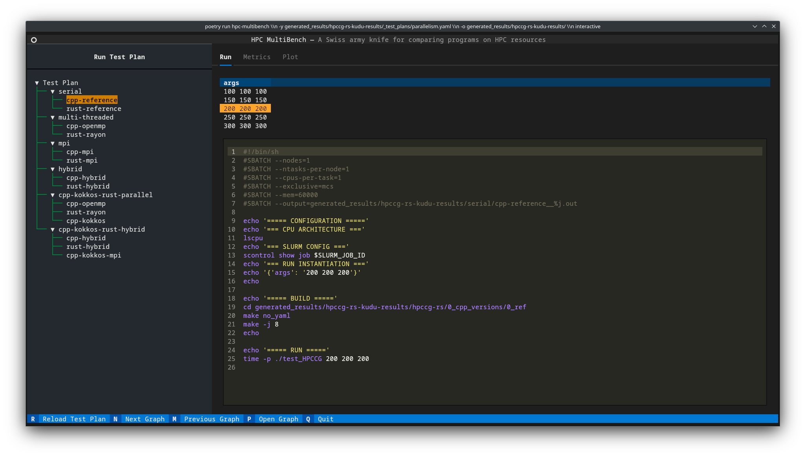
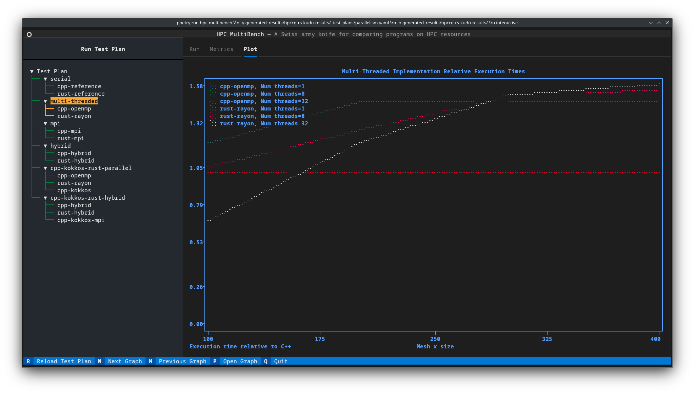
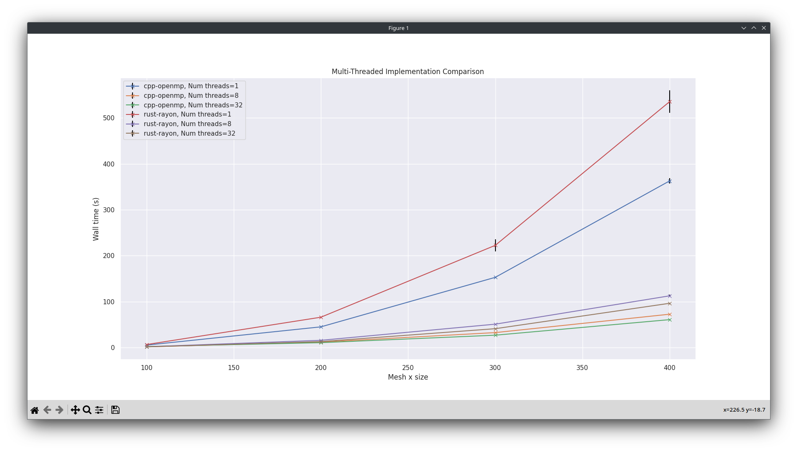
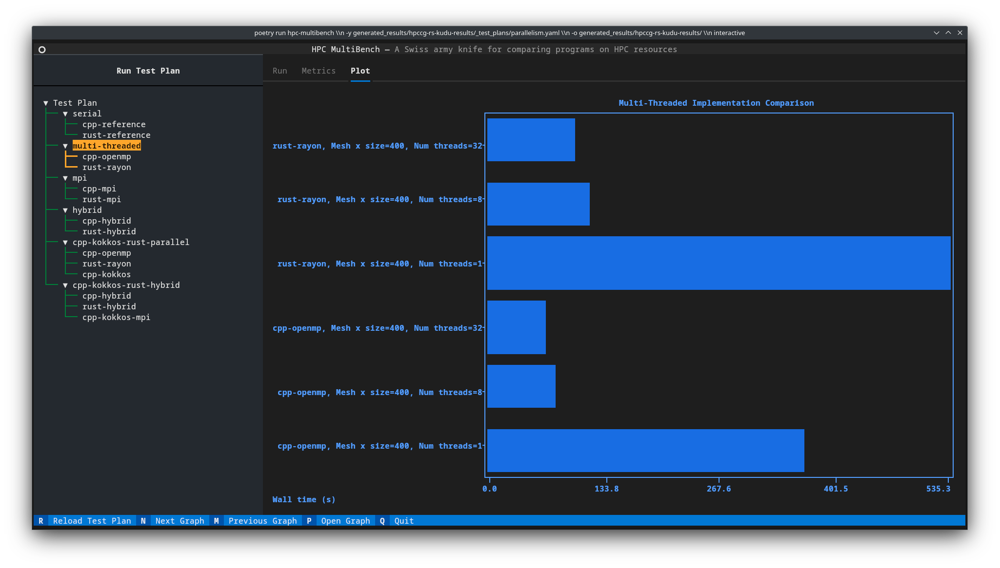
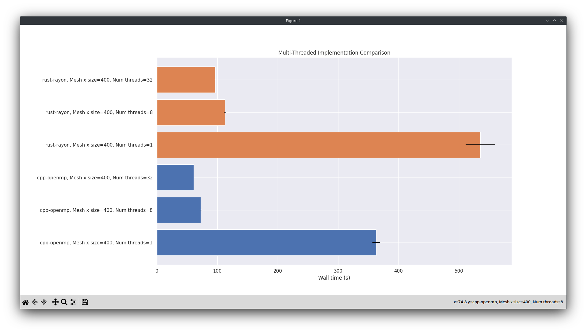
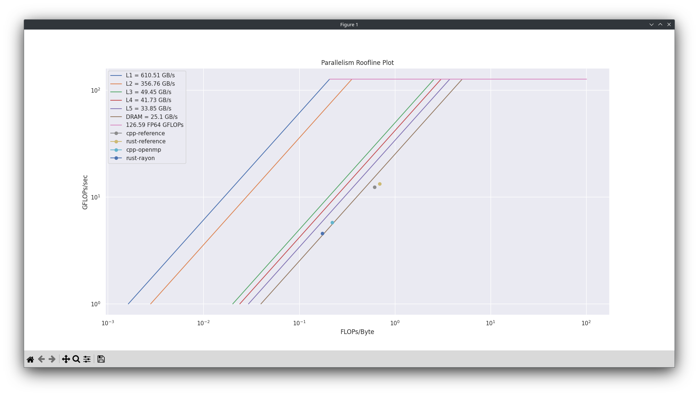

---
hide:
  - navigation
---

# Gallery

This page shows a gallery of the capabilities of the HPC MultiBench tool.

## Viewing run configurations

<figure markdown="span">
  { loading=lazy }
  <figcaption>A screenshot of the TUI viewing a run configuration, including the instantiation of variables and the Slurm sbatch file to run.</figcaption>
</figure>

## Viewing aggregated metrics

<figure markdown="span">
  { loading=lazy }
  <figcaption>A screenshot of the TUI viewing the metric results extracted from and aggregated across a set of runs defined in the YAML file.</figcaption>
</figure>

## Dispatching runs

<figure markdown="span">
  { loading=lazy }
  <figcaption>A screenshot of the TUI showing a modal dialog as it spawns Slurm jobs after  the "Run Test Plan" button is pressed.</figcaption>
</figure>

## Line plots

<figure markdown="span">
  { loading=lazy }
  <figcaption>A screenshot of a a line plot of the metrics rendered entirely in the terminal.</figcaption>
</figure>

<figure markdown="span">
  { loading=lazy }
  <figcaption>A screenshot of a a line plot of the metrics rendered entirely in the terminal.</figcaption>
</figure>

<figure markdown="span">
  { loading=lazy }
  <figcaption>A screenshot of a Matplotlib window spawned by the TUI displaying a line plot including error bars of the metrics.</figcaption>
</figure>

## Bar plots

<figure markdown="span">
  { loading=lazy }
  <figcaption>A screenshot of a a bar plot of the metrics rendered entirely in the terminal.</figcaption>
</figure>

<figure markdown="span">
  { loading=lazy }
  <figcaption>A screenshot of a Matplotlib window spawned by the TUI displaying a bar plot including error bars of the metrics.</figcaption>
</figure>

## Roofline plots

<figure markdown="span">
  { loading=lazy }
  <figcaption>A screenshot of a a roofline plot of the metrics rendered entirely in the terminal.</figcaption>
</figure>

<figure markdown="span">
  { loading=lazy }
  <figcaption>A screenshot of a Matplotlib window spawned by the TUI displaying a roofline plot including error bars of the metrics.</figcaption>
</figure>
