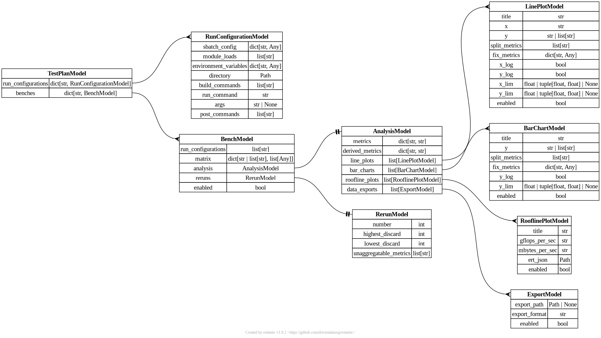

---
hide:
  - navigation
---

# YAML Schema

The YAML schema is the key abstraction which allows similar workflows for
performance analysis to be captured by this single tool.

Pydantic is used to parse the YAML file, and as such a full description of the
YAML schema can be seen in the entity-relationship diagram of the Pydantic
model, shown below.

<figure markdown="span">
  { loading=lazy }
  <figcaption>A diagram of the Pydantic model used to parse the YAML schema, generated using erdantic.</figcaption>
</figure>

<!-- ## Run Configurations

## Test Benches

### Reruns

### Matrix

### Analysis

#### Metrics

#### Plotting -->
